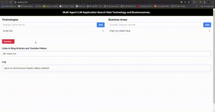

## Table of Contents
- [Demo](#demo)
- [Description](#description)
- [Installation Backend](#installation-backend)
- [Installation Frontend](#installation-frontend)
- [Run Application](#run-application)
- [Contact](#contact)

# Demo


# Description
This project aims to develop a Multi-Agent System utilizing Crew AI to efficiently extract and curate content from various sources. The system focuses on retrieving and presenting the most relevant and up-to-date information in two specific fields: Technology and Business Areas. The primary goal is to gather three high-quality blogs and three engaging YouTube videos in each field, providing users with valuable insights and resources.

# Installation Backend
### Create Virtual Environment
Then create new environment where contain nessessary packages to this project.
Ensure you have Python 3.10+ installed.
```cmd
python -m venv .venv
```
Activate new enviroment
```cmd
.venv\Scripts\activate
```
Then, install the required dependencies using pip:
```cmd
pip install -r requirements.txt
```
### Notes
You need to create a .env file to store essential keys for the project such as OPENAI_API_KEY, LANGCHAIN_API_KEY, SECRET_KEY,ALLOWED_HOSTS, APP_DEBUG,  and others.
# Installation Frontend
Ensure Node.js and npm are installed
run
```cmd
node -v
npm -v
```
if installed, you should see their version numbers. For example:
```cmd
v20.8.0
10.1.0
```
### Create a React Application
Create the Next.js frontend template in terminal::
```cmd
px create-next-app@latest frontend --typescript --tailwind --eslint
```

### Test the Frontend
Start the React development server:
```cmd
npm run dev
```
Visit the URL shown in your terminal (usually http://localhost:3000) to view your React app’s welcome page.

# Run Application
All done! To run the application, start the Flask server and the React development server
In 2 separate terminals, make sure you’re in the root directory of your Flask project, run:
```cmd
cd backend
```
```cmd
python api.py
```
and in the frontend directory, run:
```cmd
cd frontend
npm run dev
```
Visit the URL shown in your terminal (usually http://localhost:3000) to view the app.

# Contact
For questions, contributions, or bug reports, please feel free to reach out:

- Email: [hoangcongtrong02.dut@gmail.com](hoangcongtrong02.dut@gmail.com)
- Linkedin: [https://www.linkedin.com/in/hoangtrong151102/](https://www.linkedin.com/in/hoangtrong151102/)
- Instagram: [https://www.instagram.com/h.c.trong_02/](https://www.instagram.com/h.c.trong_02/)

I appreciate your feedback and involvement!


